# End-to-End Execution Plan

## Goal

Run `openclaw-zero-token` locally, verify chat works, enable web research, connect WhatsApp, and use it to draft real estate analysis responses.

## Step 1: Prerequisites

- Confirm required tools are installed:
  - Node.js `>=22.12.0`
  - `npm`
  - `pnpm` (install via `corepack enable && corepack prepare pnpm@latest --activate` if missing)
  - Google Chrome
- Work from repo root: [/Users/joeli/Desktop/files/github/openclaw-zero-token](/Users/joeli/Desktop/files/github/openclaw-zero-token)

## Step 2: Build Once

- Run:
  - `npm install`
  - `npm run build`
  - `pnpm ui:build`
- Expect build artifacts for backend/UI to be generated before runtime.

## Step 3: Start Auth Browser

- Run: `./start-chrome-debug.sh`
- Keep this debug Chrome running.
- In this debug browser, sign in to providers you want to use (ChatGPT/Claude/Gemini/etc.).

## Step 4: Onboard Providers

- Run: `./onboard.sh`
- Complete provider auth capture in the wizard.
- Important: only providers completed here will appear later in `/models`.

## Step 5: Start Gateway + UI

- Run: `./server.sh start`
- Optional health check: `./server.sh status`
- Open local UI: `http://127.0.0.1:3001/` (or tokenized URL shown by startup output).

## Step 6: Validate Core Chat

- In UI chat, run `/models` and confirm configured providers/models are listed.
- Send a test message and confirm reply succeeds.

## Step 7: Enable Web Research For Real Estate Analysis

- Configure one search provider key for `web_search`:
  - `BRAVE_API_KEY`, or
  - `PERPLEXITY_API_KEY` / `OPENROUTER_API_KEY`, or
  - `XAI_API_KEY`
- Tool behavior reference: [/Users/joeli/Desktop/files/github/openclaw-zero-token/src/agents/tools/web-search.ts](/Users/joeli/Desktop/files/github/openclaw-zero-token/src/agents/tools/web-search.ts)

## Step 8: Run Web UI Real-Estate Analysis Test

- Send a structured prompt in the Web UI chat:
  - "Draft a real estate analysis for Irvine, CA covering market trend, price/rent outlook, neighborhood-level drivers, risks, and bull/base/bear scenarios. Cite recent sources."
- Confirm response quality and citations.

## Step 9: Link WhatsApp Channel

- Run: `openclaw channels login --channel whatsapp`
- Scan QR in WhatsApp -> Linked Devices.
- Verify channel status with `openclaw channels status --probe`.

## Step 10: Set WhatsApp Access Policy And Validate WhatsApp Prompt

- Ensure DM access allows your sender:
  - Preferred: `pairing` or `allowlist` mode.
  - If `allowlist`, include your number in `allowFrom`.
- Reference config shape: [/Users/joeli/Desktop/files/github/openclaw-zero-token/src/config/types.whatsapp.ts](/Users/joeli/Desktop/files/github/openclaw-zero-token/src/config/types.whatsapp.ts)
- Send the same real-estate prompt in WhatsApp and confirm response + citations.

## Step 11: Daily Startup Routine

- Use this sequence each day (or when sessions expire):
  - `./start-chrome-debug.sh`
  - `./onboard.sh` (as needed)
  - `./server.sh start`

```mermaid
flowchart LR
installBuild[InstallAndBuild] --> debugChrome[StartDebugChrome]
debugChrome --> onboardProviders[RunOnboardAuth]
onboardProviders --> startGateway[StartGatewayUI]
startGateway --> validateModels[ValidateModelsAndChat]
validateModels --> setSearchKeys[SetWebSearchKeys]
setSearchKeys --> runWebUiPrompt[RunRealEstatePromptInWebUI]
runWebUiPrompt --> linkWhatsApp[LinkWhatsAppQR]
linkWhatsApp --> setDmPolicy[SetWhatsAppDmPolicy]
setDmPolicy --> runWhatsAppPrompt[RunRealEstatePromptInWhatsApp]
```

